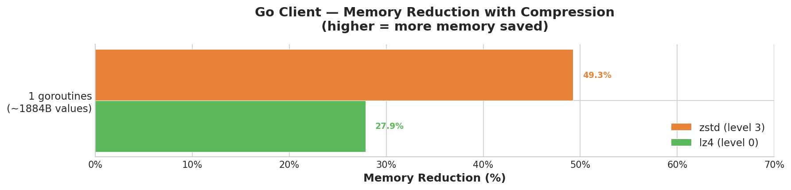
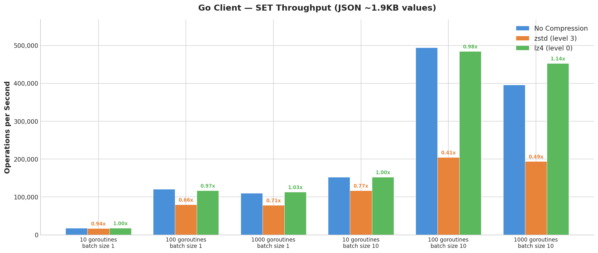
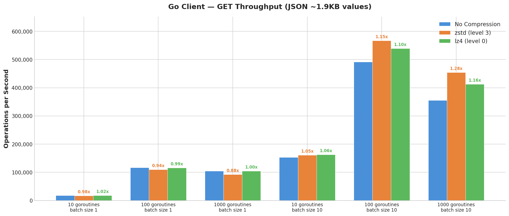
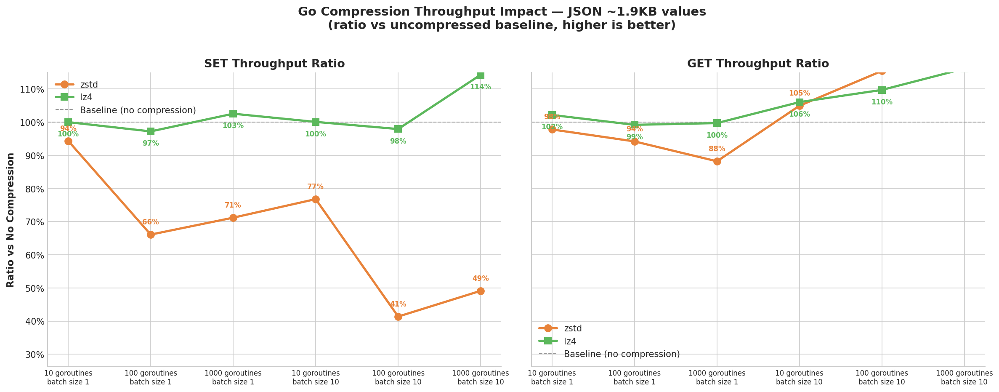

+++
title = "Transparent Compression in Valkey GLIDE for Go: Reduce Memory With a Single Line of Code"
description = "Learn how to enable automatic compression in Valkey GLIDE's Go client to reduce memory usage by up to 49% without modifying your application code."
date = 2026-01-27 01:01:01
authors = ["dknowles"]

[extra]
featured_image = "/assets/media/featured/random-03.webp"
+++

If you're caching JSON API responses, storing user sessions, or buffering HTML fragments in Valkey, there's a good chance your data is highly compressible while you're still paying full price for every byte. At scale, redundant data adds up fast. ~1KB JSON payloads across millions of keys means gigabytes of memory that could be reclaimed without losing a single field.

Transparent compression in [Valkey GLIDE](https://github.com/valkey-io/valkey-glide) offers a seamless solution to this problem. When you write data with a `SET` command, GLIDE compresses it before sending it to the server. When you read it back with `GET`, GLIDE decompresses it automatically. Your application code doesn't change — you just flip a switch in the client configuration:

```go
import (
    glide "github.com/valkey-io/valkey-glide/go/v2"
    "github.com/valkey-io/valkey-glide/go/v2/config"
)

cfg := config.NewClientConfiguration().
    WithAddress(&config.NodeAddress{Host: "localhost", Port: 6379}).
    WithCompressionConfiguration(
        config.NewCompressionConfiguration(), // That's it.
    )

client, err := glide.NewClient(cfg)

// Everything else stays exactly the same
client.Set(ctx, "user:1001:profile", string(userDataJSON))
result, _ := client.Get(ctx, "user:1001:profile")
```

In our benchmarks using the Go client, this single configuration change delivered 28–49% memory savings depending on algorithm choice, with LZ4 showing near-zero throughput impact and Zstandard (zstd) nearly halving memory usage at a moderate write throughput cost. This post walks through how the feature works, what the benchmarks show, and how to choose the right settings for your workload.

## How It Works

When you execute a `SET` command with compression enabled, GLIDE runs through a short decision path on the client side:

1. Is the value larger than the minimum size threshold (default: 64 bytes)? If not, send it uncompressed — the 5-byte header overhead would negate any savings and small values are unlikely to be compressible.
2. Compress the value using the configured algorithm (zstd or LZ4).
3. Is the compressed result actually smaller than the original? If not, send the original instead.
4. Prepend a 5-byte header that identifies the data as GLIDE-compressed, and send it to the server.

On the read path, the process reverses. GLIDE checks for the header, decompresses if present, and returns the original value. If the header isn't there, the value is returned as-is. This allows compression-enabled clients to seamlessly read uncompressed data written by older clients.

GLIDE uses a 5-byte header (`[Magic Prefix: 3 bytes][Version: 1 byte][Backend ID: 1 byte]`) to tag compressed values. The backend ID means a zstd-configured client can read LZ4-compressed data and vice versa. All GLIDE language bindings (Python, Node.js, Java, Go) share the same header format, so compressed data written from one language can be read from another.

A few safety-by-default choices keep compression from ever getting in the way: if compression fails for any reason, GLIDE silently falls back to uncompressed data. Data that already carries the GLIDE header won't be double-compressed. And after compressing, GLIDE compares sizes — if compression didn't help, the original goes through unchanged.

## Benchmark Results

We benchmarked compression using the Go GLIDE client on Amazon EC2 r7g.2xlarge instances (8 vCPUs, 64 GB RAM, AWS Graviton3) with the client and Valkey 8.0 server in the same AWS VPC. The test corpus was JSON documents averaging ~1,884 bytes per value. We swept a matrix of 80 configurations across goroutine counts (1, 2, 4, 8, 10, 25, 100, 1000) and pipeline batch sizes (1, 5, 10, 20, 50).

Unlike the Python client which needs separate parallel processes to work around the GIL, Go handles all concurrency natively via goroutines. Each goroutine gets its own GLIDE client, which maps to its own Rust Tokio runtime under the hood — this allows compression work to parallelize across OS threads without any special configuration.

The compression itself happens in Rust via FFI and is identical across all GLIDE language bindings.

## Memory Savings

The headline numbers are consistent regardless of throughput or concurrency — they depend only on the data and the algorithm:

| Backend | Server Memory | Reduction |
|---------|--------------|-----------|
| No compression | 21.4 MB | — |
| zstd (level 3) | 10.9 MB | 49.3% |
| LZ4 (level 0) | 15.5 MB | 27.8% |

Zstd saves nearly twice as much memory as LZ4 on this JSON workload. These are total server memory reductions as reported by Valkey's `MEMORY USAGE` command — they include per-key overhead (key storage, metadata, allocator alignment) that doesn't compress, so the effective memory ratio is lower than the raw algorithm compression ratio you'd see compressing the same data outside of Valkey.



## The Core Tradeoff: Memory vs Throughput

The two algorithms represent a clear tradeoff:

- **LZ4** delivers 27.8% memory savings with near-zero throughput impact. Across all 40 LZ4 configurations in our sweep, SET throughput ratio vs uncompressed ranged from 0.87x to 1.07x. Some configurations were actually *faster* with LZ4 because smaller payloads reduced network transfer time. Peak throughput with LZ4: 592K SET TPS / 811K GET TPS — matching or exceeding the uncompressed baseline.

- **Zstd** delivers 49.3% memory savings with a moderate CPU cost. SET throughput ratios ranged from 0.41x to 0.97x. The cost is proportional to throughput: at low throughput (batch=1, no pipelining), zstd costs only 3–7%. At high throughput with batching, the cost grows as compression becomes a larger fraction of total per-operation time.

Here's a representative slice at 10 goroutines:

| Batch Size | Baseline SET | zstd SET | zstd Ratio | LZ4 SET | LZ4 Ratio |
|------------|-------------|----------|------------|---------|-----------|
| 1 | 17,891 | 16,881 | 0.94x | 17,894 | 1.00x |
| 5 | 82,951 | 74,472 | 0.90x | 83,842 | 1.01x |
| 10 | 152,649 | 117,218 | 0.77x | 152,778 | 1.00x |
| 20 | 275,326 | 172,454 | 0.63x | 260,032 | 0.94x |
| 50 | 491,173 | 232,056 | 0.47x | 453,602 | 0.92x |

At batch=1 (no pipelining), zstd costs just 6% — the network round-trip dominates and compression overhead is negligible. As batching pushes throughput higher, compression CPU time becomes a larger share of the total. LZ4 stays within a few percent of baseline across the board.





## Scaling with Goroutines

One of Go's strengths is effortless concurrency. Our benchmarks show that both compression backends scale cleanly with goroutine count up to the hardware limit (8 vCPUs):

| Goroutines | Baseline SET | zstd SET | zstd Ratio | LZ4 SET | LZ4 Ratio |
|------------|-------------|----------|------------|---------|-----------|
| 1 | 18,205 | 13,327 | 0.73x | 17,058 | 0.94x |
| 2 | 32,919 | 24,074 | 0.73x | 32,963 | 1.00x |
| 4 | 63,996 | 50,648 | 0.79x | 61,789 | 0.97x |
| 8 | 124,916 | 94,587 | 0.76x | 118,091 | 0.95x |
| 10 | 146,831 | 117,218 | 0.80x | 152,778 | 1.04x |
| 25 | 348,691 | 203,420 | 0.58x | 349,196 | 1.00x |
| 100 | 498,108 | 204,558 | 0.41x | 484,338 | 0.97x |

Zstd scales linearly from 1 to 8 goroutines (13K → 95K SET TPS, a 7.1x improvement on 8 cores), then plateaus around 200K as compression CPU saturates the available cores. LZ4 tracks the uncompressed baseline almost exactly at every goroutine count.


## Batching Is the Real Throughput Lever

Going from batch size 1 to 50 at 10 goroutines takes baseline SET throughput from 18K to 491K TPS — a 27x improvement that dwarfs any compression effect. Even with zstd compression, batched operations at batch=50 (232K TPS) outperform unbatched uncompressed operations (18K TPS) by 13x. Optimize your batching strategy first, then choose your compression backend.


## Latency

At batch=1 (no pipelining), zstd adds a fraction of a millisecond to SET latency — from 0.50ms to 0.55ms p50 at 10 goroutines. LZ4 adds essentially nothing. At higher batch sizes, per-operation latency drops for all backends because batching amortizes round-trip cost.


## Choosing the Right Configuration

**Start with LZ4** if throughput matters. Switch to zstd if you need maximum memory savings and have throughput headroom. The savings you'll see depend heavily on your data type and value size — HTML compresses best, session data compresses least, and anything under 100 bytes isn't worth compressing. Skip compression entirely for already-compressed data (images, video, pre-compressed content).

For value sizes:
- **Under 100 bytes**: Skip compression. Neither algorithm saves meaningful memory at this size — the 5-byte header overhead and Valkey's per-key metadata dominate.
- **100–500 bytes**: Savings vary by data type. HTML compresses well even at ~193 bytes (20% zstd / 10.5% LZ4). Worth enabling with zstd; test with LZ4.
- **500–1,000 bytes**: Solid savings across all data types. Expect 17–49% with zstd and 0–39% with LZ4 depending on data type.
- **Over 1,000 bytes**: Strongly recommended. Expect 24–50% with zstd and 12–39% with LZ4.

For batched operations: prefer LZ4. Zstd throughput drops as batch size increases because compression CPU becomes the bottleneck.

Here's a complete configuration example:

```go
import (
    glide "github.com/valkey-io/valkey-glide/go/v2"
    "github.com/valkey-io/valkey-glide/go/v2/config"
)

cfg := config.NewClientConfiguration().
    WithAddress(&config.NodeAddress{Host: "localhost", Port: 6379}).
    WithCompressionConfiguration(
        config.NewCompressionConfiguration().
            WithBackend(config.LZ4).          // or config.ZSTD
            WithCompressionLevel(0).          // lz4: -128 to 12; zstd: -131072 to 22
            WithMinCompressionSize(64),       // Skip values smaller than 64 bytes
    )

client, err := glide.NewClient(cfg)
```

Compression works identically with `ClusterClient` — just pass the same compression configuration to your cluster config.

## Gradual Rollout

One of the most practical aspects of GLIDE's compression design is that you don't need a big-bang migration. Compression-enabled clients read uncompressed data transparently. Clients configured with zstd can read LZ4-compressed data and vice versa. This means you can roll out incrementally: deploy new clients with compression enabled, and as keys expire or get updated through normal application flow, data naturally migrates to compressed format — no migration scripts, no downtime.

## Conclusion

Transparent compression gives you a meaningful reduction in memory usage with minimal effort. LZ4 is effectively free at 28% savings; zstd nearly halves memory at a moderate write throughput cost that scales predictably with goroutine count. The feature is available today across all GLIDE language bindings and requires only a single configuration change.

We'd love to hear about your experience with compression — what data types you're compressing, what savings you're seeing, and what would make the feature more useful. Join the conversation on [GitHub Discussions](https://github.com/valkey-io/valkey-glide/discussions).

To get started:
- [Valkey GLIDE GitHub Repository](https://github.com/valkey-io/valkey-glide)
- [Go Compression Benchmark Tool & Data](https://github.com/valkey-io/valkey-glide/tree/main/benchmarks/compression_benchmark)
