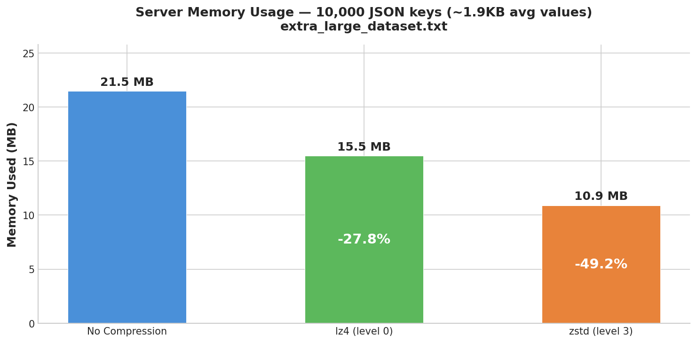
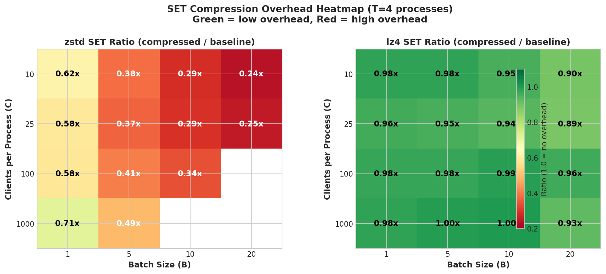
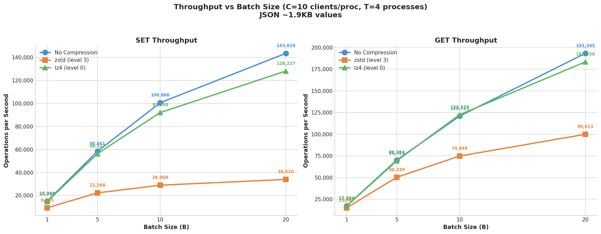
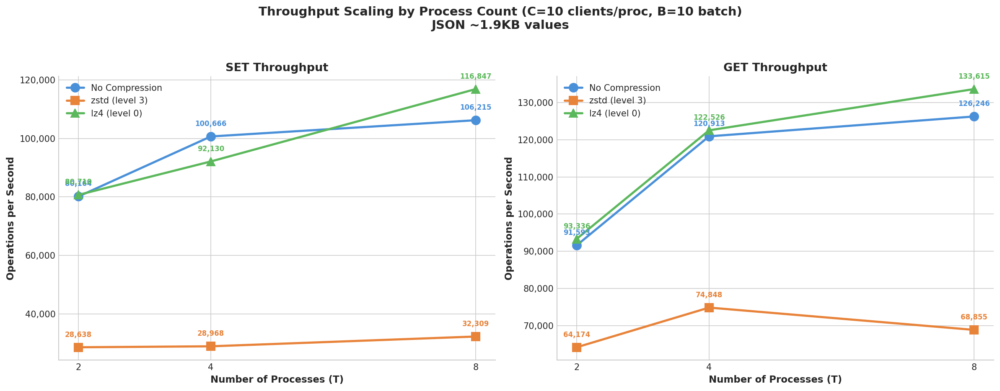
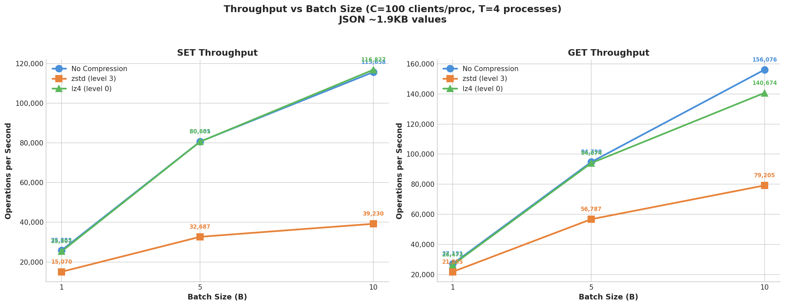
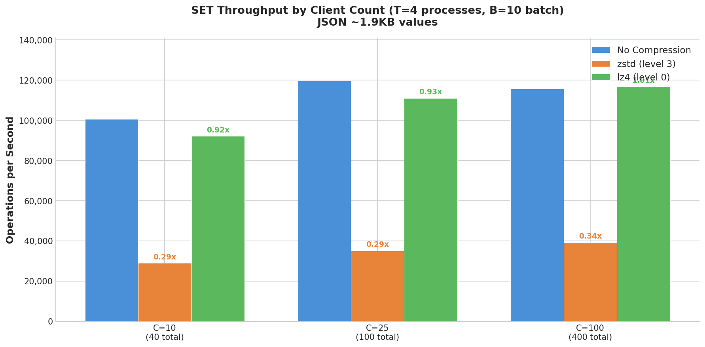
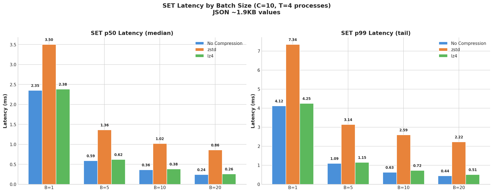

+++
title = "Transparent Compression in Valkey GLIDE: Reduce Memory With a Single Line of Code"
description = "Learn how to enable automatic compression in Valkey GLIDE to reduce memory usage by up to 49% without modifying your application code."
date = 2026-01-27 01:01:01
authors = ["dknowles"]

[extra]
featured_image = "/assets/media/featured/random-03.webp"
+++

If you're caching JSON API responses, storing user sessions, or buffering HTML fragments in Valkey, there's a good chance your data is highly compressible — and you're paying full price for every byte. Network bandwidth and memory aren't free, and at scale, redundant data adds up fast. A 1KB JSON payload repeated across millions of keys means gigabytes of memory that could be reclaimed without losing a single field.

Transparent compression in Valkey GLIDE tackles this head-on. When you write data with a `SET` command, GLIDE compresses it before sending it to the server. When you read it back with `GET`, GLIDE decompresses it automatically. Your application code doesn't change at all — you just flip a switch in the client configuration:

```python
from glide import (
    GlideClient,
    GlideClientConfiguration,
    NodeAddress,
    CompressionConfiguration,
)

config = GlideClientConfiguration(
    addresses=[NodeAddress(host="localhost", port=6379)],
    compression=CompressionConfiguration(enabled=True)  # That's it.
)
client = await GlideClient.create(config)

# Everything else stays exactly the same
await client.set("user:1001:profile", json.dumps(user_data))
profile = json.loads(await client.get("user:1001:profile"))
```

In our benchmarks, this single configuration change delivered 28–49% memory savings depending on algorithm choice [parallel_zstd_c10_t4_b1.txt, parallel_lz4_c10_t4_b1.txt], with lz4 showing zero measurable throughput impact and zstd nearly halving memory usage at the cost of some write throughput. This post walks through how the feature works under the hood, what the benchmarks show, and how to choose the right settings for your workload.

## How It Works

When you execute a `SET` command with compression enabled, GLIDE runs through a short decision path on the client side:

1. Is the value larger than the minimum size threshold (default: 64 bytes)? If not, send it uncompressed — the 5-byte header overhead would negate any savings.
2. Compress the value using the configured algorithm (zstd or lz4).
3. Is the compressed result actually smaller than the original? If not, send the original instead.
4. Prepend a 5-byte header that identifies the data as GLIDE-compressed, and send it to the server.

On the read path, the process reverses. GLIDE checks for the header, decompresses if present, and returns the original value. If the header isn't there, the value is returned as-is — meaning compression-enabled clients can seamlessly read uncompressed data written by older clients.

### The Header Format

GLIDE uses a simple 5-byte header to tag compressed values:

```
[Magic Prefix: 3 bytes][Version: 1 byte][Backend ID: 1 byte][Compressed Data]

Magic Prefix: 0x00, 0x01, 0x02 (identifies GLIDE-compressed data)
Version: 0x00 (current format version)
Backend ID: 0x01 (zstd), 0x02 (lz4)
```

This design keeps things interoperable. The magic prefix is statistically unlikely to collide with real data. The backend ID means a zstd-configured client can read lz4-compressed data and vice versa. The version byte leaves room for future format changes without breaking existing data. And all GLIDE language bindings (Python, Node.js, Java, Go) share the same header format, so compressed data written from one language can be read from another.

### Safety by Default

A few design choices keep compression from ever getting in the way:

- If compression fails for any reason (memory allocation, corrupt input), GLIDE silently falls back to sending uncompressed data. Your application never sees compression errors.
- Data that already carries the GLIDE magic header won't be double-compressed.
- After compressing, GLIDE compares sizes. If compression didn't help, the original goes through unchanged.

### Supported Algorithms

GLIDE ships with two compression backends:

**Zstandard (zstd)** — Levels range from -131072 to 22 (default: 3). Zstd offers the best compression ratio. It's the right choice when memory savings are your primary goal and you have throughput headroom to spare.

**LZ4** — Levels range from -128 to 12 (default: 0). LZ4 prioritizes raw speed over compression ratio. If your application is throughput-sensitive, uses pipeline batching, or needs the lowest possible latency, LZ4 is the better pick.

## Benchmark Results

We benchmarked compression using a parallel multi-process architecture to push realistic throughput levels. All tests ran on Amazon EC2 r7g.2xlarge instances (8 vCPUs, 64 GB RAM, AWS Graviton3) with the client and Valkey 8.0 server deployed in the same AWS VPC and availability zone. The benchmark used the Python GLIDE client, where compression is implemented in the Rust core via FFI — the compression logic itself is language-independent, though baseline throughput characteristics vary by language binding.

### Benchmark Methodology

Python's Global Interpreter Lock (GIL) prevents a single process from saturating the server. To work around this, we ran multiple Python processes in parallel, each with its own GIL, unique key prefix, and set of async clients. We swept a matrix of configurations:

- **C** (clients per process): 10, 25, 100, 1,000
- **T** (parallel processes): 2, 4, 8
- **B** (pipeline batch size): 1, 5, 10, 20

Each configuration ran 10,000 keys × 10 iterations per process, with aggregate TPS summed across all processes. The test corpus was extra-large JSON documents averaging ~1,884 bytes per value — representative of cached API responses, document metadata, and content payloads.

### Memory Savings: The Headline Numbers

The first thing to look at is how much memory each algorithm saves on the server. These numbers are consistent regardless of throughput or concurrency — they depend only on the data and the algorithm.

| Backend | Server Memory | Reduction |
|---------|--------------|-----------|
| No compression | 21.5 MB | — |
| zstd (level 3) | 10.9 MB | **49.2%** |
| lz4 (level 0) | 15.5 MB | **27.8%** |

[zstd memory: 10,905,968 bytes from parallel_zstd_c10_t4_b1.txt; lz4 memory: 15,492,592 bytes from parallel_lz4_c10_t4_b1.txt; baseline: 21,464,816 bytes from both files. Reduction = (21464816 - compressed) / 21464816.]

Zstd saves nearly twice as much memory as lz4 on this JSON workload. These are total server memory reductions as reported by Valkey's `INFO memory` — they include per-key overhead (key storage, metadata, allocator alignment) that doesn't compress, so the effective memory ratio (1.97x for zstd, 1.39x for lz4) is lower than the raw algorithm compression ratio you'd see compressing the same data outside of Valkey.



### The Core Tradeoff: Memory vs Throughput

The two algorithms represent a clear tradeoff. Here's the summary:

| | Memory Savings | SET Throughput Impact | Best For |
|---|---|---|---|
| **lz4** | 27.8% [parallel_lz4_c10_t4_b1.txt] | ~0% (effectively free) [ratio range 0.89–1.14x across all 44 lz4 result files] | High-throughput workloads where every op/sec matters |
| **zstd** | 49.2% [parallel_zstd_c10_t4_b1.txt] | 10–75% cost depending on load [ratio range 0.22–0.89x across all 38 zstd result files] | Memory-constrained environments with throughput headroom |

### lz4: Compression That Doesn't Cost Anything

Across all 44 successful lz4 configurations in our sweep, SET throughput ratio vs uncompressed ranged from 0.89x to 1.14x [min: parallel_lz4_c10_t4_b20.txt and parallel_lz4_c25_t4_b20.txt at 0.89x; max: parallel_lz4_c25_t8_b5.txt at 1.14x]. The average was ~1.0x. Some configurations were actually *faster* with lz4 compression because smaller payloads reduced network transfer time.

Peak throughput with lz4 compression: **180K SET TPS / 245K GET TPS** [parallel_lz4_c100_t8_b20.txt: lz4 SET 179,957 TPS, lz4 GET 244,647 TPS; baseline in same file: SET 180,866 TPS, GET 236,192 TPS] — identical to the uncompressed baseline.

If you want 28% memory savings [parallel_lz4_c10_t4_b1.txt] with zero throughput impact, lz4 is the answer.

### zstd: Better Compression, Real CPU Cost

Zstd tells a different story. SET throughput ratios ranged from 0.22x to 0.89x [min: parallel_zstd_c10_t8_b20.txt and parallel_zstd_c25_t8_b20.txt at 0.22x; max: parallel_zstd_c1000_t2_b1.txt at 0.89x], and the pattern is consistent: the higher the baseline throughput, the worse the ratio. Without batching (B=1), zstd costs 11–42% of SET throughput [parallel_zstd_c1000_t2_b1.txt: 0.89x to parallel_zstd_c100_t4_b1.txt: 0.58x]. With aggressive batching (B=20), the cost grows to 70–78% because compression becomes CPU-bound [parallel_zstd_c10_t8_b20.txt: 0.22x; parallel_zstd_c10_t4_b20.txt: 0.24x].

GET operations are less affected (0.43x–0.95x) [min: parallel_zstd_c25_t8_b20.txt; max: parallel_zstd_c100_t2_b1.txt] because decompression is inherently cheaper than compression.

Here are the numbers at 4 parallel processes with 10 clients each — the configuration where the client is most efficient and compression cost is most visible:

| Batch Size | Baseline SET | zstd SET | zstd Ratio | lz4 SET | lz4 Ratio |
|------------|-------------|----------|------------|---------|-----------|
| 1 | 15,060 | 9,295 | 0.62x | 14,718 | 0.98x |
| 5 | 58,401 | 22,268 | 0.38x | 56,327 | 0.98x |
| 10 | 100,666 | 28,968 | 0.29x | 92,130 | 0.95x |
| 20 | 143,629 | 34,010 | 0.24x | 128,227 | 0.90x |

[zstd column: parallel_zstd_c10_t4_b1.txt, parallel_zstd_c10_t4_b5.txt, parallel_zstd_c10_t4_b10.txt, parallel_zstd_c10_t4_b20.txt; lz4 column: parallel_lz4_c10_t4_b1.txt, parallel_lz4_c10_t4_b5.txt, parallel_lz4_c10_t4_b10.txt, parallel_lz4_c10_t4_b20.txt. Baseline SET from the "no compression" run in each file. Note: lz4 B=10 baseline is 96,733 vs zstd B=10 baseline 100,666 — slight run-to-run variance.]

The trend is clear: as batching pushes throughput higher, zstd's CPU cost becomes the bottleneck. lz4 stays within a few percent of baseline across the board.



### Batching Is the Real Throughput Lever

Before worrying about compression backend choice, consider batching. Going from B=1 to B=20 at C=10 with 4 processes takes baseline SET throughput from 15K to 144K TPS — a **9.5x improvement** [parallel_zstd_c10_t4_b1.txt: 15,060 TPS baseline; parallel_zstd_c10_t4_b20.txt: 143,629 TPS baseline; 143629/15060 = 9.5x]. This dwarfs any compression effect.

Even with zstd compression, batched operations at B=20 (34K TPS) [parallel_zstd_c10_t4_b20.txt] outperform unbatched uncompressed operations at B=1 (15K TPS) [parallel_zstd_c10_t4_b1.txt] by 2.3x. The message: optimize your batching strategy first, then choose your compression backend.



### Scaling With Parallel Processes

Adding more parallel processes scales throughput until the server or network becomes the bottleneck. At C=10 with B=10:

- 2 processes: ~80K SET TPS (baseline) [parallel_zstd_c10_t2_b10.txt: 80,164 TPS]
- 4 processes: ~101K SET TPS [parallel_zstd_c10_t4_b10.txt: 100,666 TPS]
- 8 processes: ~106K SET TPS [parallel_zstd_c10_t8_b10.txt: 106,215 TPS]

At higher batch sizes the scaling is more pronounced — at B=20, processes scale from ~120K (T=2) to ~160K (T=8) [parallel_zstd_c10_t2_b20.txt: 119,491; parallel_zstd_c10_t8_b20.txt: 159,561].

lz4 tracks the baseline closely at every scale. zstd falls further behind as aggregate throughput increases, because each process is independently CPU-bound on compression.



### What About Higher Client Counts?

At C=100 (100 async coroutines per process), the picture is similar to C=10 but with slightly higher latencies due to coroutine scheduling overhead.



At C=1,000, zstd ratios look better (0.49–0.89x) [parallel_zstd_c1000_t2_b1.txt: 0.89x; parallel_zstd_c1000_t4_b5.txt: 0.49x] — but this is misleading. Baseline throughput is already low (13–67K TPS) [parallel_zstd_c1000_t2_b1.txt: baseline 12,704 TPS; parallel_zstd_c1000_t4_b5.txt: baseline 67,180 TPS] because Python's asyncio overhead dominates at that concurrency level. The compression cost is hidden in client-side noise, not because compression got cheaper.



The C=10 numbers are the most honest for measuring compression overhead, because the client is least bottlenecked by its own runtime. C=100 is still reasonable. C=1,000 masks the true cost.

### Latency

At low batch sizes (B=1), zstd adds ~1ms to SET p50 latency (from ~2.4ms to ~3.5ms at C=10 with 4 processes) [parallel_zstd_c10_t4_b1.txt: baseline p50=2.35ms, zstd p50=3.50ms]. lz4 adds essentially nothing [parallel_lz4_c10_t4_b1.txt: baseline p50=2.32ms, lz4 p50=2.38ms].

At higher batch sizes, per-operation latency drops for all backends because batching amortizes round-trip cost. But zstd's per-operation latency remains 2–3x higher than baseline due to compression CPU time.



### A Note on These Benchmarks

These benchmarks measure compression overhead through the Python GLIDE client. The compression itself happens in Rust via FFI and is identical across all GLIDE language bindings (Java, Node.js, Go). However, baseline throughput varies by language — Java and Go clients push significantly higher TPS than Python, which means the compression-to-baseline ratio may differ. The memory savings are language-independent and will be the same regardless of which binding you use.

## Choosing the Right Configuration

| Your Priority | Choose | Level | Why |
|---------------|--------|-------|-----|
| Maximum memory savings | zstd | 3 | 49% reduction [parallel_zstd_c10_t4_b1.txt] — nearly halves memory usage |
| Maximum throughput | lz4 | 0 | Zero measurable overhead across all configs [0.89–1.14x across 44 lz4 files] |
| Lowest latency | lz4 | 0 | No added latency [parallel_lz4_c10_t4_b1.txt: +0.06ms p50] |
| Memory savings + batching | lz4 | 0 | zstd cost grows with batch size [parallel_zstd_c10_t4_b20.txt: 0.24x]; lz4 stays flat [parallel_lz4_c10_t4_b20.txt: 0.90x] |
| Moderate savings, moderate load | zstd | 3 | 49% savings with ~38% write cost unbatched [parallel_zstd_c10_t4_b1.txt: 0.62x ratio] |
| CPU-constrained | lz4 | 0 | Minimal CPU impact |

For value sizes:
- **< 100 bytes**: Skip compression. The 5-byte header overhead negates savings at small sizes [all_data_type_results.csv: 38-byte JSON = 0.0% savings, 98-byte JSON = 0.8% savings].
- **100–500 bytes**: Expect 12–37% savings depending on data type [all_data_type_results.csv: session data 951 bytes = 24.1% zstd / 11.5% lz4; HTML 556 bytes = 37.2% zstd]. Worth enabling.
- **> 500 bytes**: Expect 24–49% savings. Strongly recommended [all_data_type_results.csv: HTML 1247 bytes = 49.0% zstd; JSON 1884 bytes = 49.3% zstd].

For batched operations:
- **No batching**: Either algorithm works. zstd gives better compression with ~38% write overhead at C=10 T=4 [parallel_zstd_c10_t4_b1.txt: 0.62x ratio; range across all B=1 configs: 0.58–0.89x].
- **Batching enabled**: Prefer lz4. zstd throughput drops significantly as batch size increases — down to 0.24x baseline at B=20 [parallel_zstd_c10_t4_b20.txt].

**Start with lz4 at level 0** if throughput matters. Switch to zstd at level 3 if you need maximum memory savings and have throughput headroom. Skip compression entirely for values under 100 bytes or already-compressed data (images, video, pre-compressed content).

## Getting Started

Here's a complete configuration example with all available options:

```python
from glide import (
    GlideClient,
    GlideClientConfiguration,
    NodeAddress,
    CompressionConfiguration,
    CompressionBackend,
)

config = GlideClientConfiguration(
    addresses=[NodeAddress(host="localhost", port=6379)],
    compression=CompressionConfiguration(
        enabled=True,
        backend=CompressionBackend.LZ4,     # or CompressionBackend.ZSTD
        compression_level=0,                 # lz4: -128 to 12; zstd: -131072 to 22
        min_compression_size=64              # Skip values smaller than 64 bytes
    )
)

client = await GlideClient.create(config)
```

To use zstd instead, change `backend=CompressionBackend.ZSTD` and `compression_level=3`. Everything else stays the same. Compression works identically with `GlideClusterClient` — just pass the same `CompressionConfiguration` to your cluster config.

| Option | Type | Default | Description |
|--------|------|---------|-------------|
| `enabled` | bool | `False` | Master switch for compression |
| `backend` | CompressionBackend | `ZSTD` | Algorithm: `ZSTD` or `LZ4` |
| `compression_level` | int | 3 (zstd), 0 (lz4) | Algorithm-specific compression level |
| `min_compression_size` | int | 64 | Minimum value size in bytes to attempt compression |

## Backward Compatibility and Gradual Rollout

One of the most practical aspects of GLIDE's compression design is that you don't need a big-bang migration.

Compression-enabled clients read uncompressed data transparently — if the magic header isn't present, the value is returned as-is. Clients configured with zstd can read lz4-compressed data and vice versa, because the backend ID in the header tells GLIDE which decompression algorithm to use. Compression level only affects the write path, so any client can decompress regardless of the level used during compression.

This means you can roll out compression incrementally:

1. **Phase 1**: Deploy new clients with compression enabled. They write compressed data but still read old uncompressed data without issues.
2. **Phase 2**: As keys expire or get updated through normal application flow, data naturally migrates to compressed format.
3. **Phase 3**: Eventually, most data is compressed — no migration scripts, no downtime, no coordination between deployments.

## Reproducing These Results

The benchmark tool and all test data are included in the Valkey GLIDE repository at [`benchmarks/compression_benchmark/`](https://github.com/valkey-io/valkey-glide/tree/main/benchmarks/compression_benchmark). The tool uses Python async clients to measure SET/GET throughput, latency percentiles (p50, p95, p99), and memory usage with and without compression.

To run the parallel benchmarks yourself:

```bash
git clone https://github.com/valkey-io/valkey-glide.git
cd valkey-glide/benchmarks/compression_benchmark

pip install valkey-glide valkey

# Single-process benchmark
python3 benchmark.py \
    --data-file example_data/json/extra_large_dataset.txt \
    --host <your-server-ip> \
    --port 6379 \
    --no-server \
    --clients 10 \
    --iterations 100 \
    --backend lz4 \
    --output my_results.csv

# Multi-process parallel benchmark (bypasses Python GIL)
bash parallel_benchmark.sh \
    --processes 4 \
    --clients 10 \
    --batch-size 10 \
    --backend lz4 \
    --data-file example_data/json/extra_large_dataset.txt \
    --host <your-server-ip> \
    --port 6379 \
    --iterations 10
```

All benchmarks should be run against a remote Valkey server (`--no-server` flag) to capture realistic network conditions. The `example_data/` directory includes HTML, JSON, CSV, and session data samples. Results are written to CSV for easy analysis.

## What's Next

Transparent compression is available today across all GLIDE language bindings. We're exploring additional improvements including dictionary-based compression for workloads with known data patterns, and adaptive compression that automatically selects the best algorithm based on observed data characteristics.

We'd love to hear about your experience with compression in production — what data types you're compressing, what savings you're seeing, and what would make the feature more useful. Join the conversation on [GitHub Discussions](https://github.com/valkey-io/valkey-glide/discussions).

To get started:
- [Valkey GLIDE GitHub Repository](https://github.com/valkey-io/valkey-glide)
- [Compression Benchmark Tool](https://github.com/valkey-io/valkey-glide/tree/main/benchmarks/compression_benchmark)
